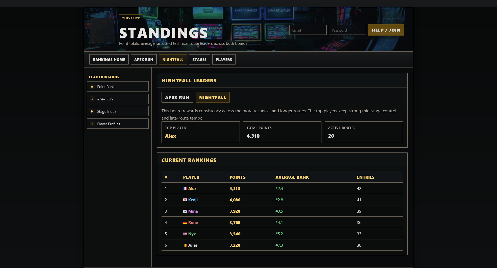
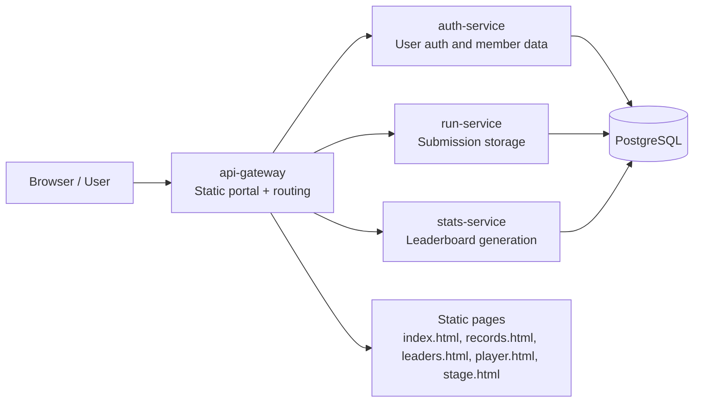

# DockerEye007

DockerEye007 is a fictional elite rankings portal for staged speedrun competition data. The project combines a Spring Boot microservice architecture with a static portal UI inspired by forum-style ranking boards.

## Overview

The application is designed to:

- store player submissions and stage times
- rank results by board, stage, and difficulty
- expose a public portal with player profiles, stage pages, and record tables
- support a simple auth flow for members and submissions

The current front-end is a static gateway experience built around the fictional boards "Apex Run" and "Nightfall", with player pages, route indexes, leaderboard summaries, and difficulty-based filtering.

## Screenshots

  

  
  

## Architecture

See [docs/architecture.md](docs/architecture.md) for the full diagram and service map.

## Technologies

- Java 17
- Spring Boot 3.4.3
- Gradle multi-module build
- PostgreSQL
- H2 for local development and tests
- Docker Compose
- Static HTML/CSS/JS portal served by the API gateway

## Services

- auth-service: authentication, member registration, and user data
- run-service: run submission storage and retrieval
- stats-service: leaderboard generation and ranking calculations
- api-gateway: unified entry point and static web UI

## Project structure

- api-gateway: public UI and gateway layer
- auth-service: auth API and security setup
- run-service: run submission model and persistence
- stats-service: leaderboard and scoring logic
- docker-compose.yml: local orchestration

## Run locally

1. Install Java 17.
2. Start the stack with Docker Compose:

   docker compose up --build

3. Confirm services are available:

   - API Gateway: http://localhost:8080
   - API Gateway health: http://localhost:8080/actuator/health
   - Auth service: http://localhost:8081/api/auth
   - Run service: http://localhost:8082/api/runs
   - Stats service: http://localhost:8083/api/stats

4. Open the dashboard:

   http://localhost:8080

## Main routes

- Homepage: http://localhost:8080/index.html
- Records: http://localhost:8080/records.html
- Standings: http://localhost:8080/leaders.html
- Players: http://localhost:8080/player.html
- Stage index: http://localhost:8080/levels.html
- Submit run: http://localhost:8080/submit.html

## Example API calls

- Register user:
  POST http://localhost:8081/api/auth/register
- Login:
  POST http://localhost:8081/api/auth/login
- Submit run:
  POST http://localhost:8082/api/runs/submit
- List runs:
  GET http://localhost:8082/api/runs
- Leaderboard:
  GET http://localhost:8083/api/stats/leaderboard

## Quick success check

The project is considered running when:

- the gateway responds on http://localhost:8080
- the demo pages load correctly
- the health endpoints return status UP for the services
- the leaderboard endpoint returns JSON data

## Contributors

- Evowind
- Kemory
