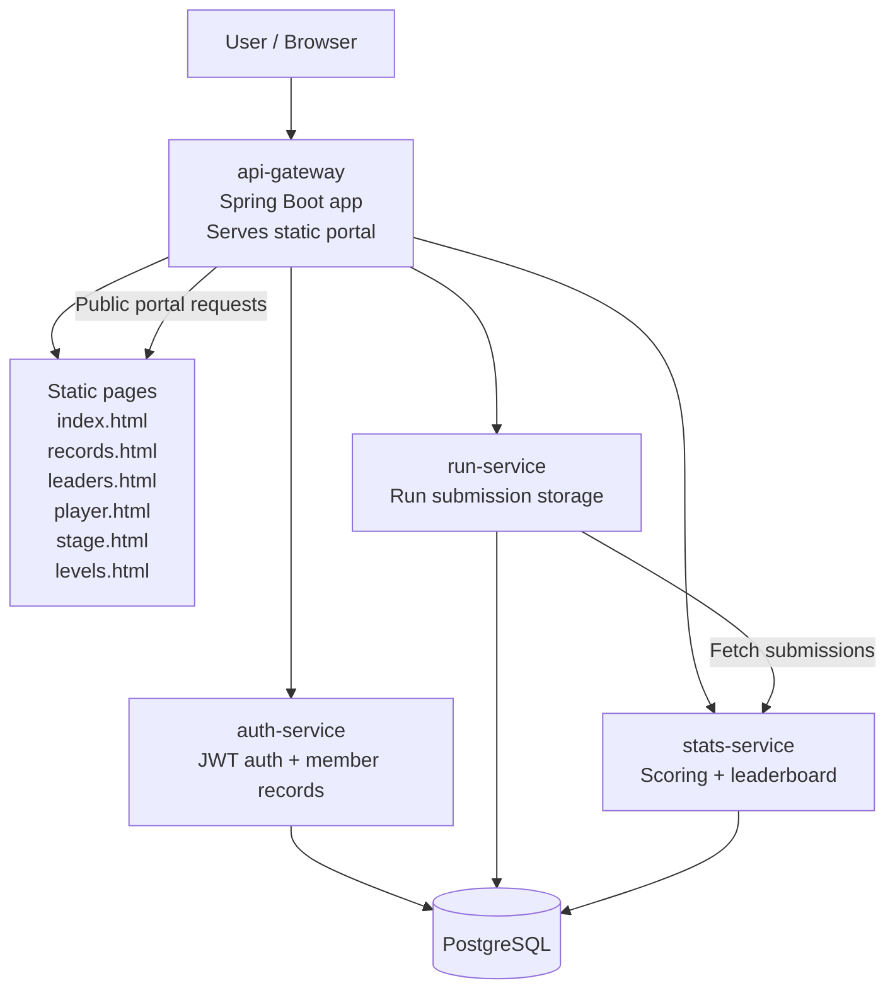

# Architecture

## System overview

This project is a microservice-based ranking portal for staged run submissions. The API gateway serves the public HTML, CSS, and JavaScript interface while the backend services provide member management, leaderboard generation, and run tracking.

## Runtime flow

1. The browser loads the static portal from the API gateway.
2. The portal fetches leaderboard JSON from the stats service.
3. Players submit run data to the run service.
4. The stats service aggregates those submissions and calculates ranking data.
5. Auth requests are handled by the auth service for member sign-up and login.

## Board model

The portal is organized around two fictional boards:

- Apex Run: faster, shorter, sharper stage routes
- Nightfall: longer, more technical, more control-heavy routes

Each run is associated with:

- player name
- board / game
- stage name
- category
- difficulty
- time in milliseconds

This lets the UI display:

- board-specific records
- stage leaderboards
- difficulty sorting
- individual player histories

## Container layout

The stack is orchestrated with Docker Compose:

- postgres: database persistence layer
- auth-service: authentication backend
- run-service: run storage backend
- stats-service: ranking logic backend
- api-gateway: public app and gateway front door

## Benefits

- clear separation between public UI and service logic
- easy to extend with additional boards or stage metadata
- simple local development via Docker Compose
- clean leaderboard generation divorced from direct database concerns
